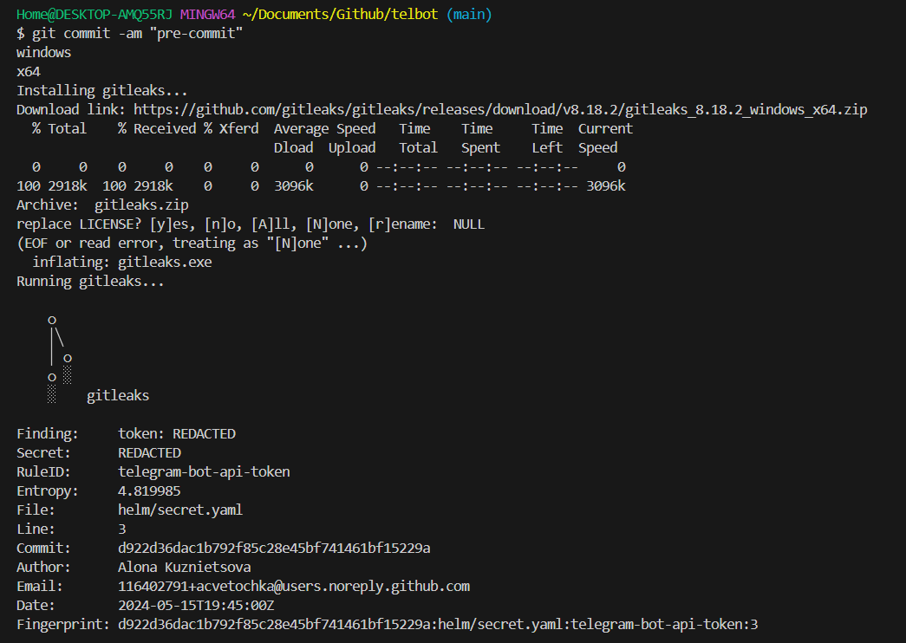
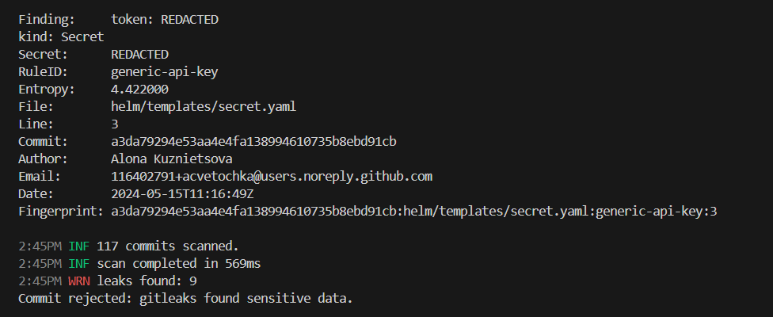

# Інструкція до використання скриптy pre-commit hook

1. Завантажити файл скрипту [pre-commit](./pre-commit) до свого репозиторію

2. Надання прав на виконання скрипту
```shell
chmod +x pre-commit
```

3. Створення символічного посилання на скрипт
- Якщо файл знаходиться в корені прокту
```shell
ln -s ../../pre-commit .git/hooks/pre-commit
```
- У разі розміщення скрипту в директорії, задайте також назву директорії (тут - pre-commit-hook)
```shell
ln -s ../../pre-commit-hook/pre-commit .git/hooks/pre-commit
```

4. Вмикання/вимикання pre-commit hook
- Для вимкнення pre-commit hook скористуйтесь командою 
```shell
git config --local hooks.gitleaks.enable false
```

- Щоб умівкнути pre-commit hook змініть параметр на true
```shell
git config --local hooks.gitleaks.enable true
```

Під час коміту скрипт перевірить чи встановлено gitleaks, якщо ні - то встановить версію відповідну операційній системі



Після цього скрипт запустить gitleaks, який перевірятиме файли на наявність чутливих даних. Якщо будуть знайдені паролі, токени, секрети - коміт буде відхилено

